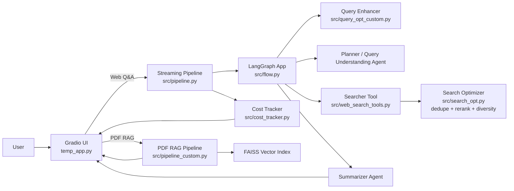
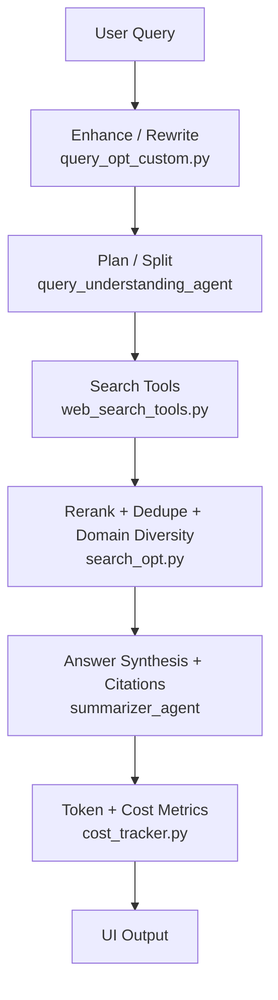
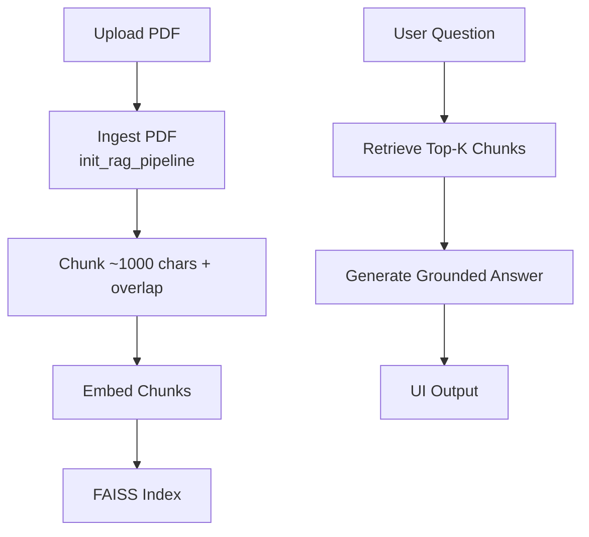

# Perplexity Lite Agent

A lightweight “Perplexity-style” agentic Q&A assistant that produces **grounded answers with citations** via:
1) **Agentic Web Search Q&A** (multi-provider retrieval + reranking + synthesis), and  
2) **Document Q&A (PDF RAG)** (upload PDF → retrieve relevant chunks → answer grounded in the document).

It also exposes **step-by-step progress (streaming)** and **basic token/cost metrics** in the UI.

> **Repo path (as referenced):** `perplexity-ai-agent/iteration_3`  
> **Primary UI entrypoint:** `temp_app.py`

---

## What you can do

### 1) Agentic Web Search Q&A
- Ask a question
- The system:
  - rewrites the query (time-aware search terms),
  - plans/splits into sub-queries (when needed),
  - searches across providers,
  - deduplicates + reranks results (cross-encoder) and enforces domain diversity,
  - synthesizes a final answer **with citations**,
  - shows token usage and estimated cost.

### 2) Document Q&A (PDF RAG)
- Upload a PDF
- The system:
  - chunks the PDF into ~1000-character segments with overlap,
  - embeds chunks and indexes them in **FAISS**,
  - retrieves top matching chunks per question,
  - generates an answer grounded in retrieved context.

### 3) Token / Cost Tracking
- After each response, the UI displays:
  - token usage
  - estimated spend

---

## How it works (end-to-end)

### Agentic Web Search workflow
1. **User query** → `temp_app.py`
2. **Streaming pipeline** (streams intermediate updates) → `src/pipeline.py: qa_pipeline`
3. **Query enhancement** (rewrite into search-optimized, time-aware terms) → `src/query_opt_custom.py`
4. **Planning / splitting** (decide sub-queries) → `src/flow.py: query_understanding_agent`
5. **Search + rerank**
   - Fetch results per sub-query
   - Deduplicate
   - Cross-encoder rerank
   - Enforce domain diversity
   - Select top-K sources  
   → `src/web_search_tools.py`, `src/search_opt.py`
6. **Synthesis** (final answer + citations) → `src/flow.py: summarizer_agent`
7. **Usage metrics** (token + estimated cost) → `src/cost_tracker.py`

### Document Q&A (PDF RAG) workflow
1. **Upload PDF** → `temp_app.py`
2. **Ingest + chunk** (~1000 chars + overlap) → `src/pipeline_custom.py: init_rag_pipeline`
3. **Embed + index** (FAISS) → `src/pipeline_custom.py`
4. **Retrieve + answer** → `src/pipeline_custom.py: query_rag_pipeline`

---

## Architecture

### High-level (two modes)


### Agentic Web Search (detailed)


### PDF RAG (detailed)


---

## Key modules (repo map)

### Web Q&A
- `temp_app.py` — Gradio UI (Web Q&A + Document Q&A modes)
- `src/pipeline.py` — streaming orchestration (`qa_pipeline`)
- `src/flow.py` — LangGraph agent flow (planner + summarizer agents)
- `src/query_opt_custom.py` — query rewrite/enhancement
- `src/web_search_tools.py` — tool interface for web search
- `src/search_opt.py` — provider calls + dedupe + rerank + diversity enforcement
- `src/cost_tracker.py` — token usage and cost estimation

### Document Q&A
- `src/pipeline_custom.py` — PDF ingestion + FAISS indexing + retrieval + generation

---

## Search providers

The system can pull from multiple sources (provider usage depends on configuration and intent):

- **Google CSE (primary)**  
  - `_search_google_cse` in `src/search_opt.py`
- **Tavily (secondary)**
  - `_search_travily` in `src/search_opt.py`
- **Semantic Scholar (academic intent)**
  - `_search_semantic_scholar` in `src/search_opt.py`
- **SerpAPI (optional / future)**
  - planned/optional integration

> Note: “academic intent” routing is implemented conditionally (verify exact trigger logic in `src/search_opt.py`).

---

## Token usage & cost tracking

After each response, the UI shows:
- token usage
- estimated cost/spend

Implemented in:
- `src/cost_tracker.py`

> The exact pricing assumptions depend on the model configuration used by `ChatOpenAI`. If you’re publishing a demo, document the model + pricing basis used for cost estimation.

---

## Setup

### Prerequisites
- Python 3.10+ (recommended)
- API keys for any enabled providers (see Environment Variables)
- (Optional) GPU not required; reranking via cross-encoder may be slower on CPU

### Install dependencies
This repo may use one of the following common setups. Use whichever matches the repo files you have:

**Option A: pip + requirements.txt**
```bash
python -m venv .venv
source .venv/bin/activate   # (Windows: .venv\Scripts\activate)
pip install -r requirements.txt
```

**Option B: poetry**
```bash
poetry install
poetry shell
```

> If you don’t see `requirements.txt` or `pyproject.toml`, check the repo for the actual dependency file and update this README accordingly.

---

## Environment variables

Create a `.env` file in the project root (loaded via `python-dotenv`).

| Variable | Required | Purpose |
|---|---:|---|
| `OPENAI_API_KEY` | ✅ Yes | LLM calls (ChatOpenAI) |
| `GOOGLE_CSE` | Recommended | Google Custom Search API key |
| `GOOGLE_CSE_CX` | Recommended | Google CSE engine ID |
| `TAVILY_API_KEY` | Optional | Tavily search |
| `SEMANTIC_SCHOLAR` | Optional | Semantic Scholar API key |
| `SERPAPI` | Optional | SerpAPI key (optional/future) |

Example `.env`:
```bash
OPENAI_API_KEY="..."
GOOGLE_CSE="..."
GOOGLE_CSE_CX="..."
TAVILY_API_KEY="..."
SEMANTIC_SCHOLAR="..."
SERPAPI="..."
```

---

## Run locally

### Start the Gradio app
```bash
python temp_app.py
```

Once running, open the local Gradio URL printed in the terminal.

---

## Using the app

### Web Q&A Mode
1. Enter a question.
2. Watch streamed progress:
   - query rewrite → planning → searching → reranking → synthesis → citations → cost metrics.
3. Read final answer with citations.

### Document Q&A Mode (PDF RAG)
1. Upload a PDF.
2. Ask questions about it.
3. The system retrieves relevant chunks and answers grounded in the PDF.

---

## PM-ready demo script (10 minutes)

1) **Agentic Search (3–4 min)**
- Ask a query that benefits from synthesis and citations.
- Call out: query rewrite + sub-queries + reranking + citations.

2) **Academic intent (2–3 min)**
- Use a research-style query.
- Call out Semantic Scholar integration (when triggered).

3) **RAG (2–3 min)**
- Upload a short PDF.
- Ask 2–3 questions and highlight retrieval-based grounding.

4) **Cost tracking (1 min)**
- Point out tokens + estimated spend shown after response.

---

## Configuration notes (recommended to document)

To make this repo easier for others to run, it’s helpful to centralize/configure:
- provider enable/disable flags
- top-K sources
- per-domain cap (diversity)
- chunk size + overlap for PDFs
- max tokens per stage (enhance/plan/summarize/RAG answer)
- timeouts + retries per provider

If these are currently hardcoded, consider moving them into a config file or constants module.

---

## Evaluation (recommended structure)

If you’re extending the repo, add a lightweight evaluation harness:
- `eval/queries.jsonl` — test questions (web + academic + PDF)
- `eval/rubric.md` — 1–5 scoring for groundedness, citation correctness, usefulness
- `eval/results.csv` — baseline vs iteration comparison (quality, latency, cost)

Even a small rubric-based evaluation (20–50 queries) makes the project more credible.

---

## Troubleshooting

### 1) Search returns empty / weak results
- Verify provider keys in `.env`
- Confirm Google CSE engine ID (`GOOGLE_CSE_CX`) is correct
- Check provider rate limits

### 2) Semantic Scholar not being used
- Confirm `SEMANTIC_SCHOLAR` key (if required)
- Inspect academic-intent trigger logic in `src/search_opt.py`

### 3) PDF answers are irrelevant
- Try a cleaner PDF (text-based, not scanned)
- Adjust chunk size/overlap (currently ~1000 chars + overlap)
- Confirm embedding + FAISS indexing happens after upload

### 4) High latency
- Reduce top-K sources or reranking candidates
- Add stricter timeouts for providers
- Consider caching (query→results, retrieval→answer)

### 5) Cost higher than expected
- Reduce max tokens for summarizer/RAG generator
- Cap the number of sources/chunks passed to the LLM
- Summarize long sources before synthesis

---

## Limitations

- This is a **lite** system intended for learning and iteration speed.
- Production hardening (auth, abuse prevention, privacy controls, observability dashboards) is out of scope unless explicitly added.
- PDF RAG quality depends heavily on PDF text extractability (scanned PDFs may not work without OCR).

---

## Roadmap ideas (Iteration 4+)
- Stronger citation mapping (claim → source traceability)
- Caching layer to reduce latency and cost
- Better fallbacks (provider routing + partial answer policy)
- Automated evaluation runs (regression detection)
- Docker + simple CI/CD for stable public deployment

---

## Contributing
- Keep changes small and testable.
- Prefer adding configs rather than hardcoding thresholds.
- Document new environment variables and provide sensible defaults.

---

## License
Add a LICENSE file (MIT/Apache-2.0 recommended) if you intend this to be reused publicly.
